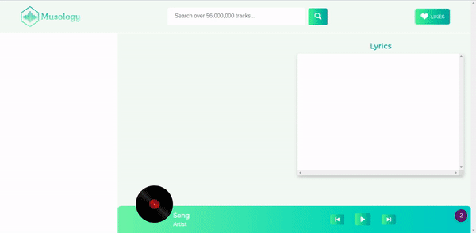

<p align="center">
    
    <br>
    <br>
       
</p>

A web application where you can search for music, listen to a preview of it and also find its lyrics. You can also like songs which will be saved in your browser.

## DEMO
<p align="center">

</p>


## Technology Stack


* Frontend: **HTML**, **CSS**, **Javascript**
* Pre-processor: **Sass**
* Bundler: **Webpack**

### API used
* For music: [Deezer API](https://rapidapi.com/deezerdevs/api/deezer-1/endpoints)

* For lyrics: [lyrics.ovh](https://lyricsovh.docs.apiary.io/#)

## Prerequisites
* [node](https://nodejs.org/en/) >= 12.16.2
* npm >= 6.14.4

## Installation

1. Clone / Download [this](https://github.com/khusharth/musology) repo.
2. Inside the project open a terminal and run:
    ```
    npm install
    ```
    This will install all the project dependencies.
3. Create a **.env** file in the project root folder and add the following:
    ```
    API_KEY = yourApiKey
    ```
    Replace yourApiKey with your own Deezer **X-RapidAPI-Key** .
    > Get your Deezer X-RapidAPI-Key from [here](https://rapidapi.com/deezerdevs/api/deezer-1).
4. To start the development server run:
    ```
    npm start
    ```

## Author
[](https://twitter.com/khusharth19) 

[](https://www.linkedin.com/in/khusharth/)
